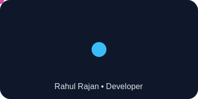

<h1 align="center">Hey 👋, I'm Rahul Rajan</h1>
<h3 align="center">🚀 CSE Student | Developer | Tech Enthusiast from India</h3>

---

  

## 👨‍💻 About Me
- 🎓 Computer Science Engineering Student  
- 💡 Passionate about building real-world projects  
- 🤖 Interested in AI, React Native & Full Stack Development  
- 📱 Currently working on smart healthcare & automation projects  
- 🎯 Goal: Build impactful tech solutions  

---

## 🛠️ Tech Stack

---

## 🌐 Connect With Me

<a href="https://rahulrajancc.github.io/portfolio-">
  🌍 Portfolio
</a>

---

## 📊 GitHub Stats

---

---

## ✨ Quote

> “Code. Create. Innovate. Repeat.”

---
