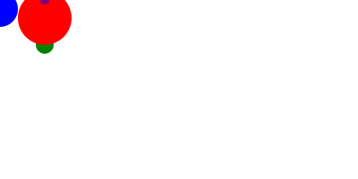

<h1>Hi 👋! My name is Rahul Rajan and I'm a CSE student, from India</h1>

###

/*

  
  

*/
###

###

 
  
  
  
  
  
  
  
  
  
  
  
  
  
    
  
     
  

###

    
  
    
    
    
    
    
  

###

 

###
